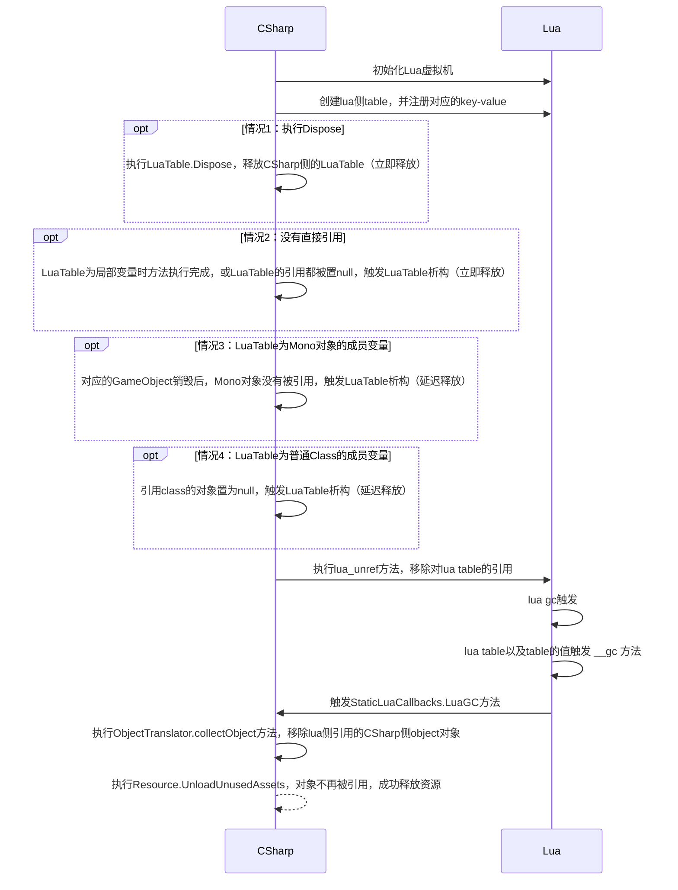

```mermaid
sequenceDiagram

CSharp ->> Lua : 初始化Lua虚拟机

CSharp ->> Lua : 创建lua侧table，并注册对应的key-value

opt 情况1：执行Dispose
CSharp ->> CSharp : 执行LuaTable.Dispose，释放CSharp侧的LuaTable（立即释放）
end

opt 情况2：没有直接引用
CSharp ->> CSharp : LuaTable为局部变量时方法执行完成，或LuaTable的引用都被置null，触发LuaTable析构（立即释放）
end

opt 情况3：LuaTable为Mono对象的成员变量
CSharp ->> CSharp : 对应的GameObject销毁后，Mono对象没有被引用，触发LuaTable析构（延迟释放）
end

opt 情况4：LuaTable为普通Class的成员变量
CSharp ->> CSharp : 引用class的对象置为null，触发LuaTable析构（延迟释放）
end


CSharp ->> Lua : 执行lua_unref方法，移除对lua table的引用

Lua ->> Lua : lua gc触发
Lua ->> Lua : lua table以及table的值触发 __gc 方法
Lua ->> CSharp : 触发StaticLuaCallbacks.LuaGC方法
CSharp ->> CSharp : 执行ObjectTranslator.collectObject方法，移除lua侧引用的CSharp侧object对象
CSharp -->> CSharp : 执行Resource.UnloadUnusedAssets，对象不再被引用，成功释放资源

```