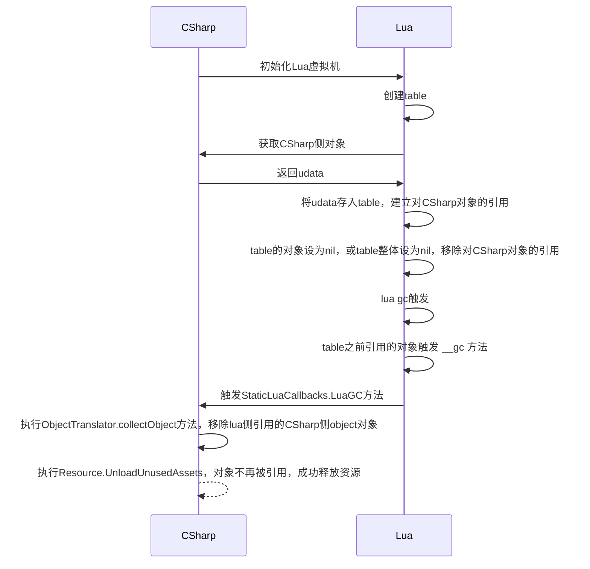

```mermaid
sequenceDiagram

CSharp ->> Lua : 初始化Lua虚拟机

Lua ->> Lua : 创建table
Lua ->> CSharp : 获取CSharp侧对象
CSharp ->> Lua : 返回udata
Lua ->> Lua : 将udata存入table，建立对CSharp对象的引用
Lua ->> Lua : table的对象设为nil，或table整体设为nil，移除对CSharp对象的引用

Lua ->> Lua : lua gc触发
Lua ->> Lua : table之前引用的对象触发 __gc 方法
Lua ->> CSharp : 触发StaticLuaCallbacks.LuaGC方法
CSharp ->> CSharp : 执行ObjectTranslator.collectObject方法，移除lua侧引用的CSharp侧object对象
CSharp -->> CSharp : 执行Resource.UnloadUnusedAssets，对象不再被引用，成功释放资源

```

