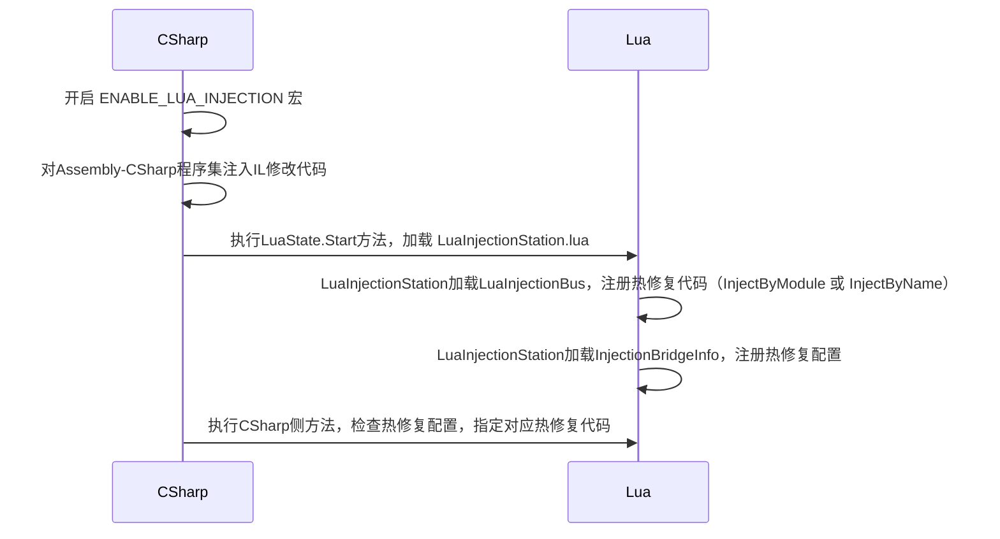

```mermaid
sequenceDiagram

CSharp ->> CSharp : 开启 ENABLE_LUA_INJECTION 宏
CSharp ->> CSharp : 对Assembly-CSharp程序集注入IL修改代码
CSharp ->> Lua : 执行LuaState.Start方法，加载 LuaInjectionStation.lua
Lua ->> Lua : LuaInjectionStation加载LuaInjectionBus，注册热修复代码（InjectByModule 或 InjectByName）
Lua ->> Lua : LuaInjectionStation加载InjectionBridgeInfo，注册热修复配置
CSharp ->> Lua : 执行CSharp侧方法，检查热修复配置，指定对应热修复代码

```