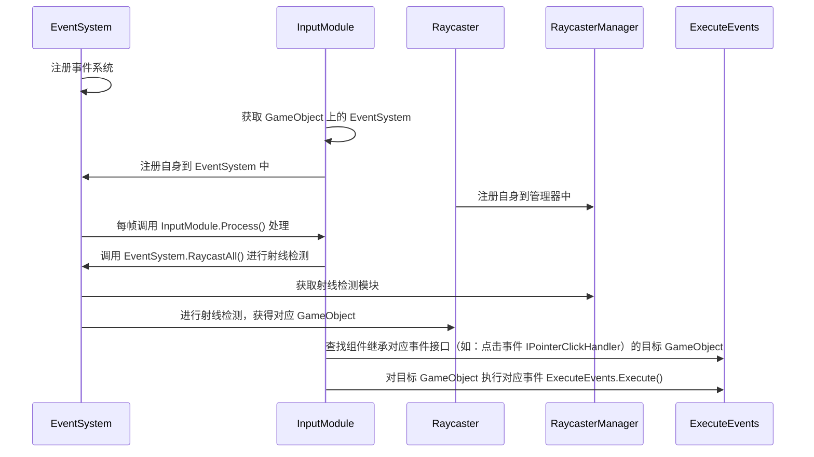

```mermaid
sequenceDiagram

EventSystem ->> EventSystem : 注册事件系统

InputModule ->> InputModule : 获取 GameObject 上的 EventSystem

InputModule ->> EventSystem : 注册自身到 EventSystem 中

Raycaster ->> RaycasterManager : 注册自身到管理器中

EventSystem ->> InputModule : 每帧调用 InputModule.Process() 处理

InputModule ->> EventSystem : 调用 EventSystem.RaycastAll() 进行射线检测

EventSystem ->> RaycasterManager : 获取射线检测模块

EventSystem ->> Raycaster : 进行射线检测，获得对应 GameObject

InputModule ->> ExecuteEvents : 查找组件继承对应事件接口（如：点击事件 IPointerClickHandler）的目标 GameObject

InputModule ->> ExecuteEvents : 对目标 GameObject 执行对应事件 ExecuteEvents.Execute()

```